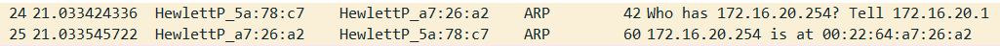
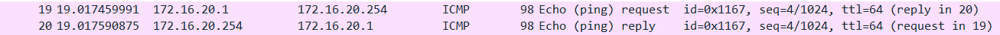

# Experiment 1

tux24 -> ip = 172.16.20.254/24      MAC = 00:22:64:A7:26:A2
tux23 -> ip = 172.16.20.1/24	    MAC = 00:21:5A:5A:78:C7 

both switch ports must be in the same vlan

ping while in tux24 -> ping 172.16.20.1 (pinging to tux23)

## What are the ARP packets adn what are they used for?

ARP stands for `Address Resolution Protocol` so the objective of the protocol is to buil the map table that asigns the received IP to the the respective MAC address. In the following image we can visualize the occurence of one ARP request.

## What are the MAC and IP addresses of the ARP packets and why?

In the upper image we can verify that tux23 (`172.16.20.1`) wants to know who as the ip `172.16.20.254` to send the packet. The answer of ARP request assigns tux24 MAC address `00:22:64:A7:26:A2` to the given IP `172.16.20.254`. 

## What packets does the ping command generate?

The ping request generates a request packet with an source and destination in order to send a message. Later a new reply packet must be generated with the source and destination IP swaped. The following image show as an example of a ping call.

## What are the MAC and IP addresses of the ping packets?

The IP and MAC addresses that exists on the upper ping packet are:
In case of request made by tux23

| PING Request | IP Address | MAC address | PC |
| ---- | ---------- | ----------- | -- |
| Source | 172.16.20.1 | 00:21:5A:5A:78:C7 | tux23 |
| Destination  | 172.16.20.254 | 00:22:64:A7:26:A2 | tux24 |

| PING Response | IP Address | MAC address | PC |
| ---- | ---------- | ----------- | -- |
| Source  | 172.16.20.254 | 00:22:64:A7:26:A2 | tux24 |
| Destination | 172.16.20.1 | 00:21:5A:5A:78:C7 | tux23 |

## How to determine if a receiving Ethernet frame is ARP, IP, ICMP?

To be an ARP frame the 13 and 14 bytes of the frame must be 0x08 0x06, this bytes are specifed in the first layer.

To be an IP frame the 13 and 14 bytes of the frame must be 0x08 0x00, this bytes are specifed in the first layer.

To be an ICMP frame, firstely the frame must be and IP frame nextely the 24 byte must be 0x01, specifed in the second layer.

## How to determine the length of a receiving frame?

The lenght is specified in the 17 and 18 bytes of the frame, in the second layer.

# Experiment 2

tux22 -> ip = 172.16.21.1          MAC = 00:21:5A:5A:76:A8

